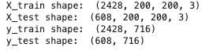

# Bird Classification

Capstone II goals

- In the case of supervised learning, picking an appropriate metric to quantify performance, and then use of that metric in cross-validation to arrive at a model that generalizes as well as possible on unseen data. Be prepared for the request: "Describe the process you used to ensure your model was properly fit."
- In all cases, discussion of the cleaning and featurization pipeline and how raw data were transformed to the data trained on. Text processing especially requires discussion.
- In the case of classification and class imbalance, discussion of how the class imbalance was addressed. Did you use a default decision threshold, or did you pick a different threshold through out-of-model knowledge (e.g. a cost-benefit matrix and a profit curve.)


## Table of Contents

- [Overview](#overview)
- [Data Preparation](#data-preparation)
- [Birds](#birds)
- [Convolutional Neural Network](#convolutional-neural-network)
- [Metric Visualizations](#metric-visualizations)
- [Summary](#summary)
- [Encountered Issues](#encountered-issues)
- [Future Work](#future-work)


## Overview

The data was pulled from the [The Cornell Lab of Ornithology](https://www.birds.cornell.edu/home).  
It is a collection of about 48,000 images and more than 400 species of birds observed in North America. Birds are separated by male, female or juvenile since they look quite different. Text files are also included that contains image file names and their corresponding labels.

Concepts and Codes:

- BytesIO: reads bytes objects
    - s3 object bodies come back as a byte string, BytesIO helps read that

Day 1:

- watch tutorials
- read tutorials
- figure out models desired for training
- download new birds
- try to load into jupyter lab
- create bird images with RBG sets

Day 2:

- AWS
- AWS
- AWS
- AWS
- AWS
- figure out how to set up EC2 instance, connect an Elastic IP address, S3 bucket
- s3 keeps crashing, need a new way to load in the numerous birds

Day 3:

- create dataframes with text files that contains information about the labels and the folders it corresponds to
- figure out how to merge all as one for easy access
- figure out how to use as labels
- create dataframes of image information
- test small set of loading in images and displaying
    - saved as array
- upload all images to s3


## Data Preparation

- load into s3 (many images) DONE
- use small sets of images first
- resize images (so model dont take too long)
- align images with labels
- get arrays
- normalize (keras normalize or simply divide by 255)
- make model
    - Sequential()
    - Flatten layer of inputs
    - dense layers of hidden layers
    - final dense layer: output
    
1. Baseline Model
- Random Forest

2. Deep Learning
- Neural Network
- CNN

<!-- <details>
    <summary>summary</summary>
    
</details>
    
<details>
    <summary>summary</summary>
    
</details>     -->
    
<br> 

<!-- wesley's op drop down -->
<details>
  <summary>
    <b> Model Comparison Code </b>  
  </summary>
  
```python
code

```
  

</details>

## Birds


<!--  -->


## Convolutional Neural Network

Shape of training sets and testing sets.



The very first model trained on a small subset in order to keep runtime small during troubleshooting.


## Metric Visualizations


## Issues Notes

- birds are labeled by species but also by gender and juvenile/adult. They DO all looke quite different especially the colors between the females and males
- A TON of labels (555 total), very sparse
- tried drag and drop with s3
- accidentally placed arguments in wrong spot and ran 50k images fail message
- another reason for hot garbage: birds dont have the same amount of images, some have 20 something, some has 120
    - checked inputs, y labels and x labels
    - checked images folders, different amounts of bird images
    - checked slicing and what images i am getting, turns out i could be slicing where each bird only has one image
        - fix by grabbing sequentially because all the birds in one folder are next to each other in dataframe
- model was awful, figured out one hot encoded the wrong numbers due to the fact that some numbers are missing and not in a perfect range


## Future Work

- KNN
- More birds
- Better Model
- TensorBoard
- Transfer Learning
- SHAP