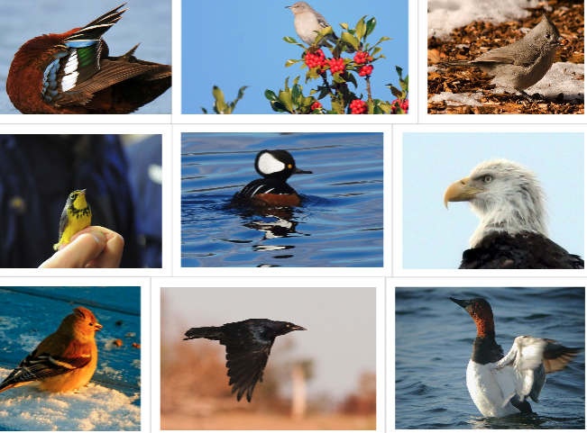

# BIRDEX
### Web based Flask app to predict the family group of birds from images using transfer learning.


## Table of Contents

- [Overview](#overview)
- [Data Preparation](#data-preparation)
    - [Birds](#birds)
- [Convolutional Neural Network](#convolutional-neural-network)
- [Results](#results)
- [Birdex: Flask App](#birdex-flask-app)
- [Future Work](#future-work)

## Overview

The data was pulled from the [The Cornell Lab of Ornithology](https://www.birds.cornell.edu/home).  
It is a collection of about 48,000 images and more than 400 species of birds observed in North America. Birds are separated by male, female or juvenile since they look quite different. Text files are also included that contains image file names and their corresponding labels.

<b>So why identify birds?</b>

Bird conservation is becoming increasingly crucial as Earth changes. Birds are an indicator species because they are highly sensitive to their surroundings and even the slightest change in temperature can alter their behaviour. Different species have various types of behaviour and pattern.

Due to the nature of birds, it is extremely difficult to track them all! This is why there are birders, using citizen science to help monitor them. Being able to identify the type of birds that are passing through certain areas can greatly help track their migratory patterns.

So why is bird conservation important? Check out this post by the American Bird Conservancy:

[Why Bird Conservation is Important](https://abcbirds.org/about/mission-and-strategy/why-conserve-birds/)

Also, they're basically modern dinosaurs.

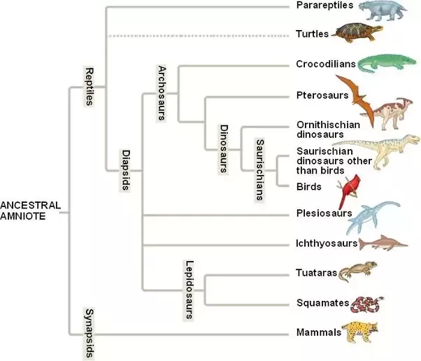

This Berkeley articles on why birds are dinosaurs (but also shows the skeptical side):
[Are Birds Really Dinosaurs?](https://ucmp.berkeley.edu/diapsids/avians.html)


## Data Preparation

Since there are many images, Amazon S3 came into play. The images are loaded into a bucket and stored in separated folders of the bird species.
For this project, 21129 images will be used which includes 39 family groups of birds.

A function is written to retrieve the images from the S3 bucket while also resizing them, convert to array, and append to a list. This is due to the need for the input of the neural network to be numpy arrays.

<details>
  <summary>
    <b> Load and Resize Image Code </b>  
  </summary>
  
```python

def resize_images_array(img_dir, folders, bucket):
    # arrays of image pixels
    img_arrays = []
    labels = []
    
    # loop through the dataframe that is linked to its label so that all images are in the same order
    for folder in tqdm(folders):
        s3 = boto3.client('s3')
        enter_folder = s3.list_objects_v2(Bucket=bucket, Prefix=f'{img_dir}/{folder}')
        for i in enter_folder['Contents'][2:]:
            try:
                filepath = i['Key']
                obj = s3.get_object(Bucket=bucket, Key=f'{filepath}')
                img_bytes = BytesIO(obj['Body'].read())
                open_img = Image.open(img_bytes)
                arr = np.array(open_img.resize((299,299)))
                img_arrays.append(arr)
                labels.append(folder)
            except:
                print(filepath) # get file_path of ones that fail to load
                continue

    return np.array(img_arrays), np.array(labels)

```
</details>

### Birds

First, a brief explanation of the <b>taxonomic hierarchy</b>:

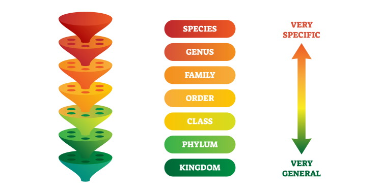

Every species belongs in a category of this hierarchy. It classifies species and group them up from broad cateogries to extremely specific groups. For example, humans belong to the Family of Hominidae, then Genus of Homo and the Species of Sapiens. "Human" is our common name!

The exploratory data analysis began with looking at the number of species in the Order group of the birds.

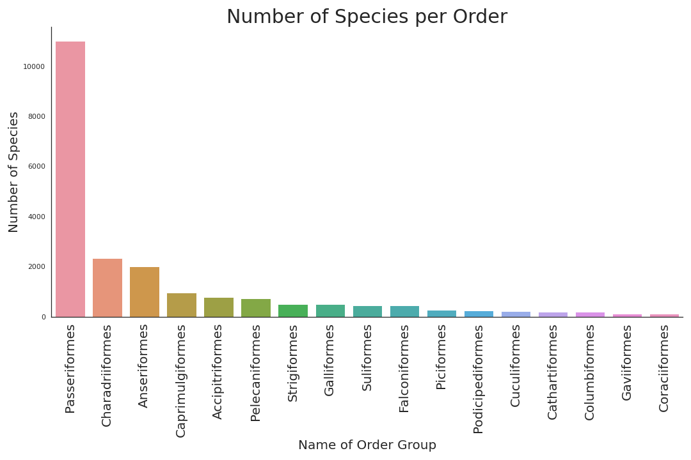

As seen in the plot, if the model were to predict the Order of the birds, there would be a huge inbalance in the dataset. Unfortunately, there are simply more birds included within the Passeriformes Order (perching birds, the largest order of birds). For example, the Leptosomiformes Order only contains one type of bird: Cuckoo Rollers!

Family is the next specific group in the taxonomic hierarchy. The model is predicting birds based on family groups so a count plot for the number of species in each family group is created.

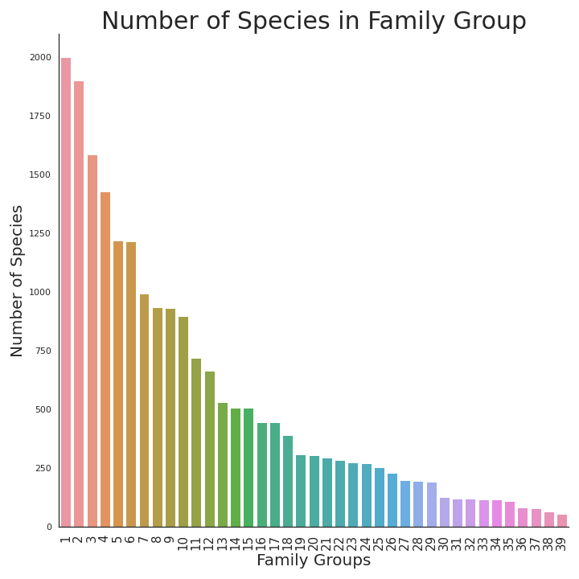

<details>
    <summary>Family Plot Legend</summary>
    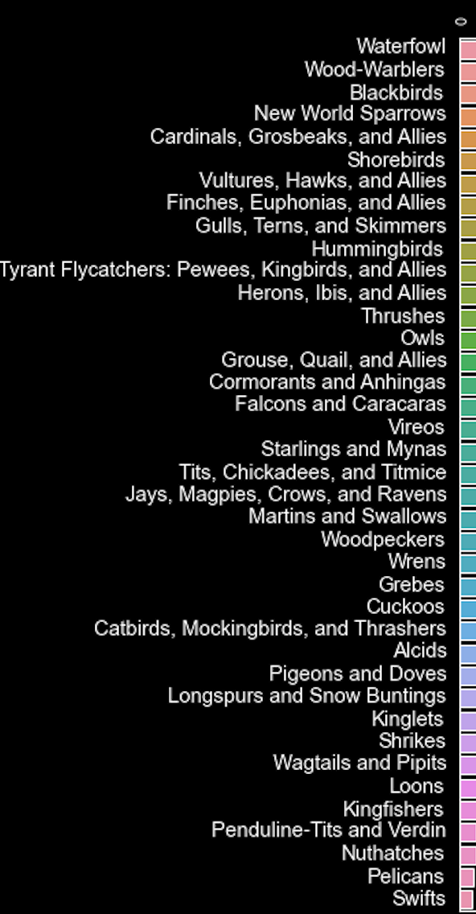
</details>


The images have 3 different channels for the color which makes up the colors in the main image.
The shape of the images are **(299,299,3)**, the third one represent the number of channels. For greyscale, it'd be 1.

Let's check out some of the contestant within the data!

Contestant 1: Waterfowl    |  Contestant 2: Grosbeak   |     Contestant 3: Hawk
:-------------------------:|:-------------------------:|:-------------------------:
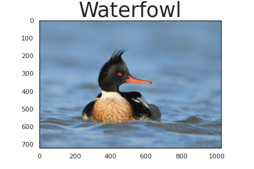| 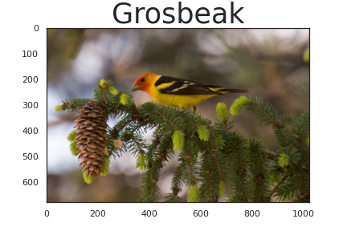 | 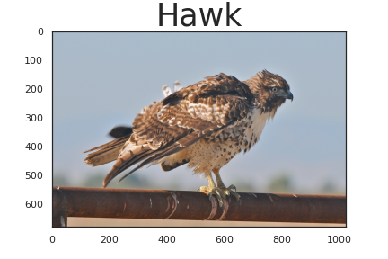

<br>

Here are the RGB Channels of three classes of birds seen in this dataset:

<br>

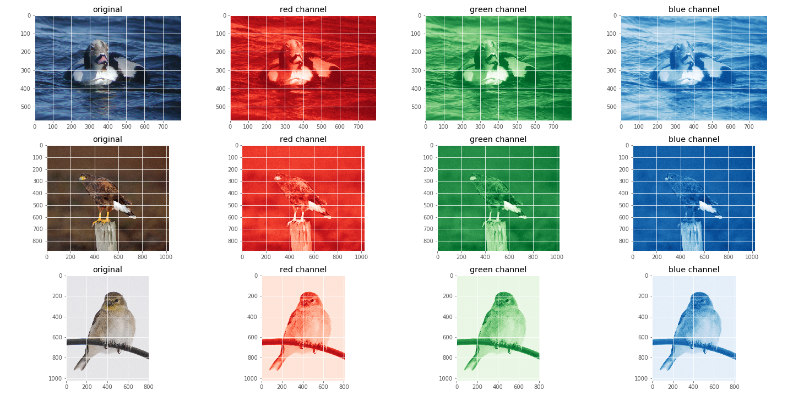

## Convolutional Neural Network

This first model was trained on a small subset (~3,000) of the total images(~40,000). This is mainly to test that the inputs of features and labels are correct. Errors did occur the very first run.

<details>
    <summary>Shape of training sets and testing sets.</summary>
    
</details>

The model is pretty weak.


This is what the CNN layers look like generally:
<details>
    <summary>CNN Code</summary>
    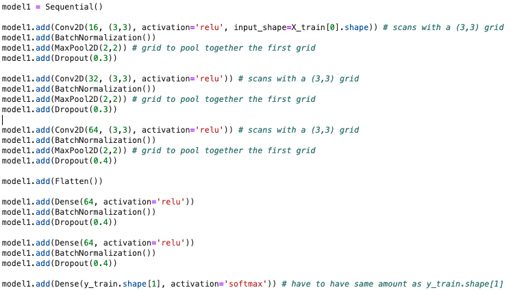
</details>

After the first awful run, a simple model will be created using 3 types of birds: ducks, finches and hawks. This is to see if the amount of classes was causing the model to do so poorly. It will later be expanded to more.

### Simple CNN Model

<details>
    <summary>CNN Model Epochs</summary>
    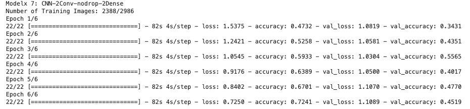
</details>

<details>
    <summary>CNN Model Accuracy/Loss Plots</summary>
    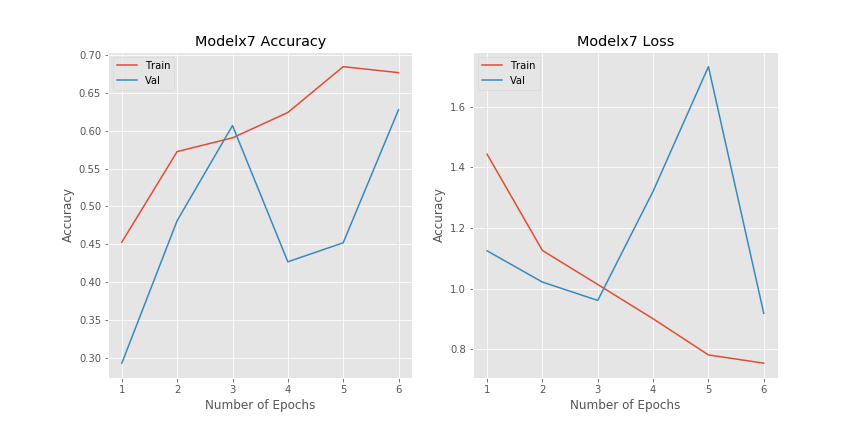
</details>

<details>
    <summary>CNN Model Confusion Matrix</summary>
    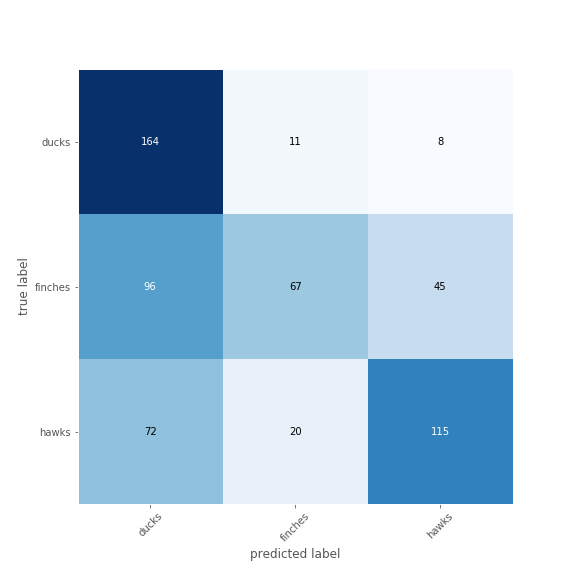
    <br>
    After a few runs, it finally captured the finches!
</details> 

### Transfer Learning using Xception Model

<details>
    <summary>Model Summary</summary>
    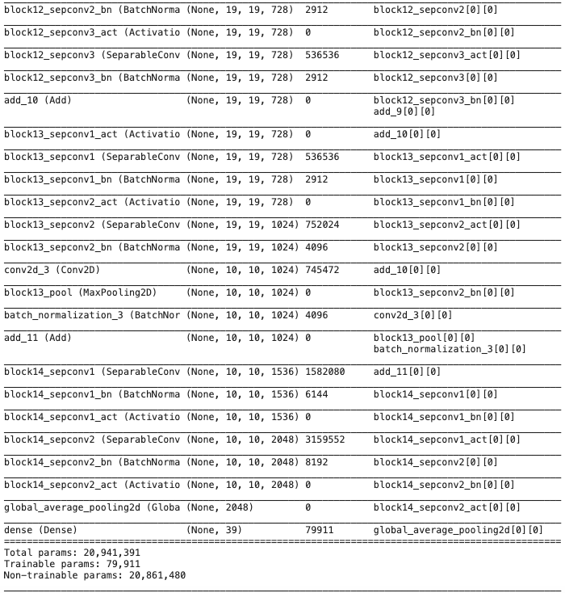
</details>

<details>
    <summary>Model Epochs</summary>
    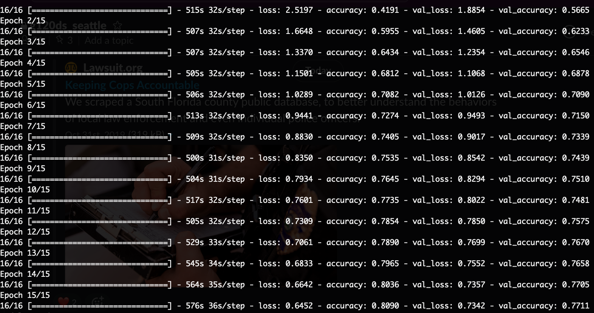
</details>

## Results:

<details>
    <summary>Model Accuracy/Loss Plots</summary>
    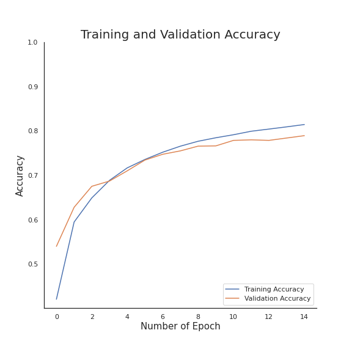
    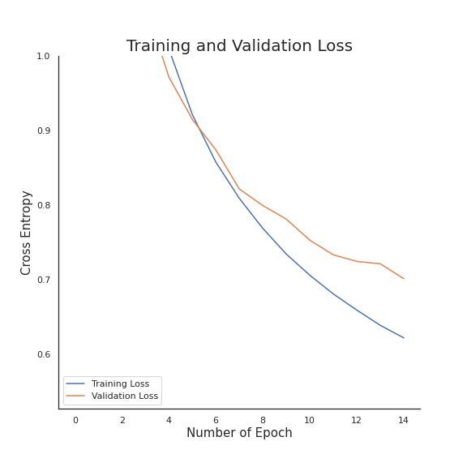
</details>

<details>
    <summary>Model Confusion Matrix</summary>
    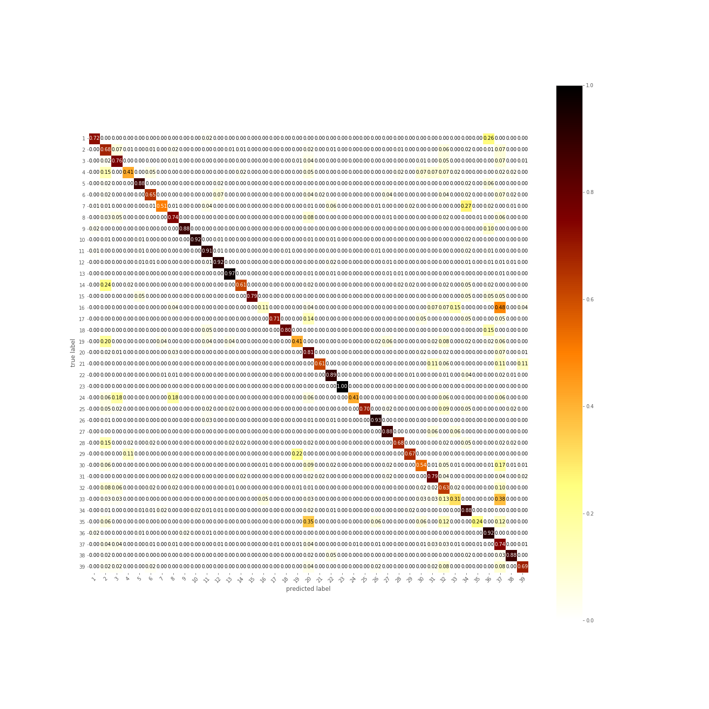
</details>

#### Confusion Matrix

There are a few birds the model seem to have predicted poorly on! Let's take a look at some of them and what birds the model tend to confuse them with.

<b>1. New World Sparrows(4) 41% vs Wood-Warblers(2) 15% </b>
     New World Sparrow     |         Wood-Warbler          |
:-------------------------:|:-------------------------:|
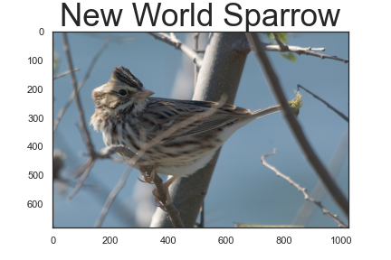| 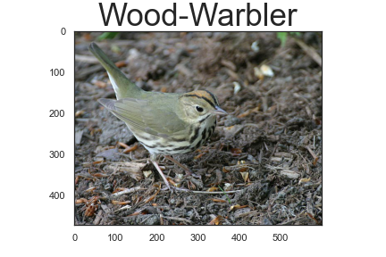 |
<br>
<p><i>New World Sparrows and Wood-Warblers seem to have their similarities: small bird, whitish belly, and brown stripes. </i></p>
<br>

<b>2. Kingfishers(35) 24% vs Tits, Chickadees, Titmice(20) 35% </b>
       Kingfisher          |         Titmouse          |          Chickadee
:-------------------------:|:-------------------------:|:-------------------------:
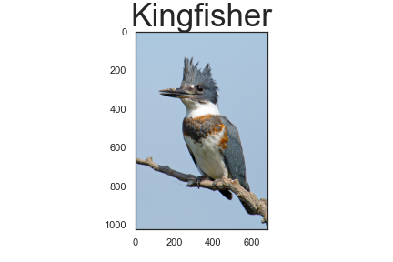| 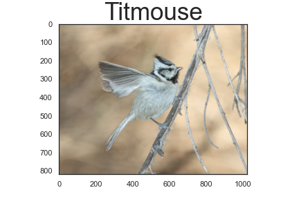 | 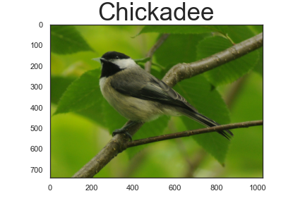

<br>
<p><i>The model is confusing quite a bit of Kingfishers to the other group. Kingfisher and Titmouse do resemble each other in a way (spiked up mohawk). However, not too much from the allies of Titmouse, the Chickadee. THe color pattern do have SOME resemblance. </i></p>
<br>

<b>3. Wagtails and Pipits(33) 31% vs Nuthatches(37) 38% </b>
           Pipit           |          Pipit 2          |          Nuthatch
:-------------------------:|:-------------------------:|:-------------------------:
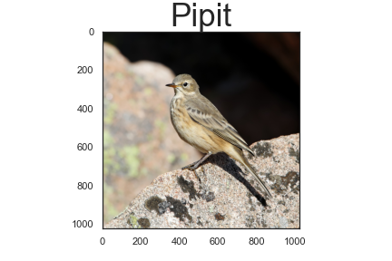| 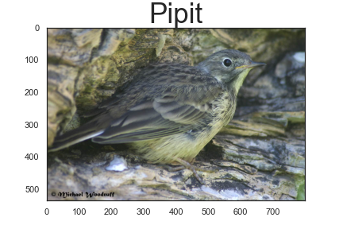 | 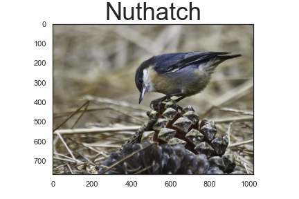

<br>
<p><i>The model is a bit confused here as well, labeling Wagtails and Pipits as more Nuthatches than the actual birds. Pipits and Nuthatches look quite different in the first image. Pipits are longer and have a tinier head. However, there are some images of Pipits that could resemble a nuthatch more. The setting of the birds are also similarly colored.</i></p>
<br>

<b>4. Cormorants and Anhingas(16) 11% vs Nuthatches(37) 48% </b>
        Anhingas           |         Nuthatch          |
:-------------------------:|:-------------------------:|
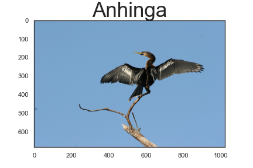|  |

<br>
<p><i>Last but not least, the family groups with the biggest discrepancy. The Cormorants and Anhingas are both tall birds with a long neck. The Nuthatches are pretty much the opposite. There can definitely be more improvement here.  </i></p>
<br>

## Birdex: Flask App

Bird Flask gif
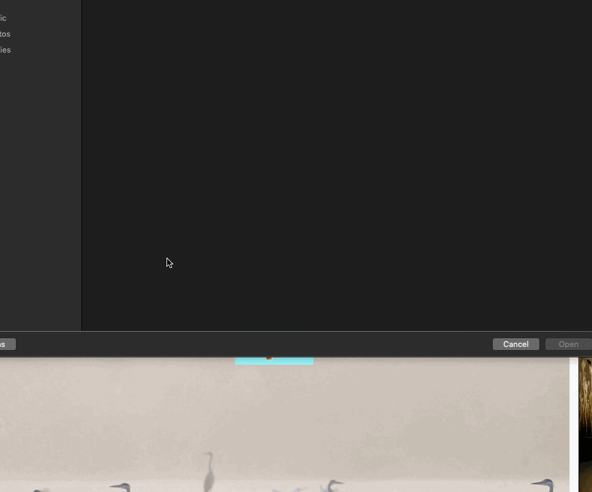
<!-- 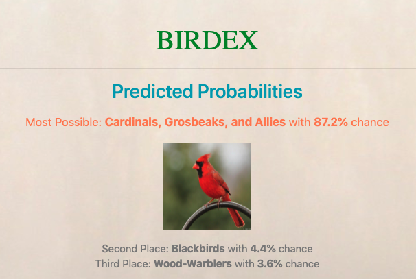 -->

<details>
    <summary>Test a person in a bird costume</summary>
    
</details>

<details>
    <summary>Test a non-bird: CAT</summary>
    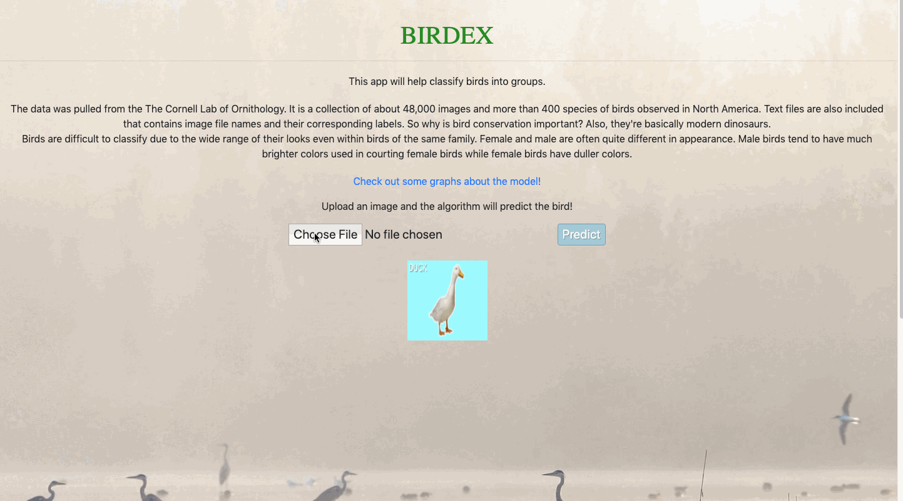
</details>

## Future Work

- [x] Better Model
- [x] Transfer Learning
- [ ] SHAP/LIME
- [ ] Clean up files
- [ ] Object Detection