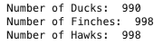
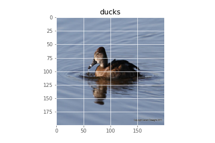
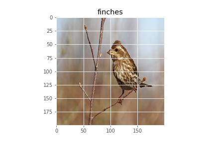
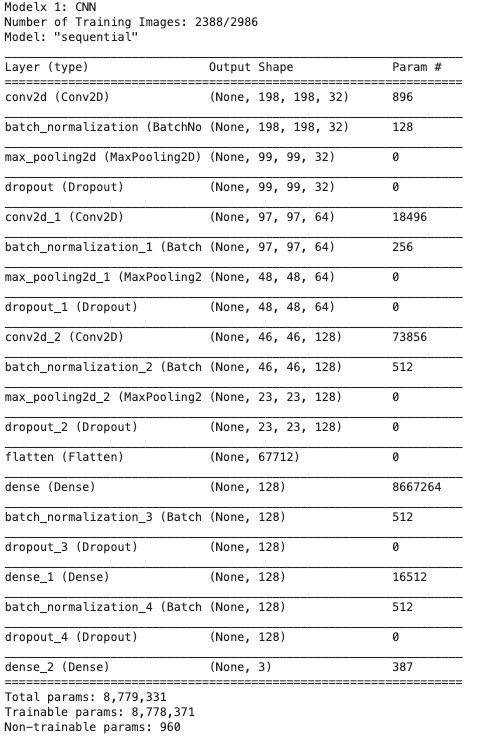
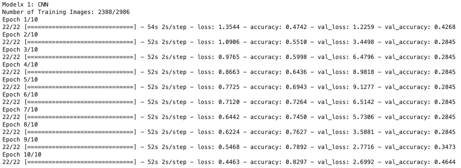
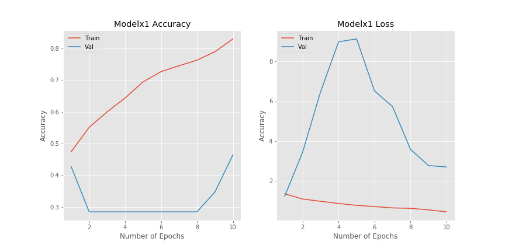
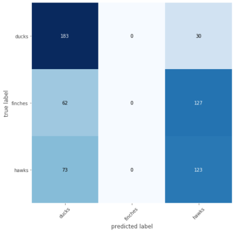

# Duck, Duck, HAWK


## Table of Contents

- [Overview](#overview)
- [Data Preparation](#data-preparation)
    - [Birds](#birds)
- [Convolutional Neural Network](#convolutional-neural-network)
- [Summary](#summary)
- [Issues Notes](#issues-notes)
- [Future Work](#future-work)

## Overview

The data was pulled from the [The Cornell Lab of Ornithology](https://www.birds.cornell.edu/home).  
It is a collection of about 48,000 images and more than 400 species of birds observed in North America. Birds are separated by male, female or juvenile since they look quite different. Text files are also included that contains image file names and their corresponding labels.

So why is bird conservation import? Check out this post by the American Bird Conservancy:

[Why Bird Conservation is Important](https://abcbirds.org/about/mission-and-strategy/why-conserve-birds/)

Also, they're basically modern dinosaurs.


This Berkeley articles on why birds are dinosaurs (but also shows the skeptical side):
[Are Birds Really Dinosaurs?](https://ucmp.berkeley.edu/diapsids/avians.html)


## Data Preparation

Since there are many images, Amazon S3 came into play. The images are loaded into a bucket and stored in separated folders of the bird species.
While the original goal is to classify around 555 species of birds with more than 40,000 images, as it will be shown later, it was not possible for now. The pivoted project goal is to identify 3 different types of birds: **ducks, finches, and hawks**.

A function is written to retrieve the images from the S3 bucket while also resizing them, convert to array, and append to a list. This is due to the need for the input of the neural network to be numpy arrays.

<details>
  <summary>
    <b> Load and Resize Image Code </b>  
  </summary>
  
```python

def resize_images_array(img_dir, folders, bucket):
    # arrays of image pixels
    img_arrays = []
    labels = []
    
    # loop through the dataframe that is linked to its label so that all images are in the same order
    for folder in tqdm(folders):
        s3 = boto3.client('s3')
        enter_folder = s3.list_objects_v2(Bucket=bucket, Prefix=f'{img_dir}/{folder}')
        for i in enter_folder['Contents'][2:]:
            try:
                filepath = i['Key']
                obj = s3.get_object(Bucket=bucket, Key=f'{filepath}')
                img_bytes = BytesIO(obj['Body'].read())
                open_img = Image.open(img_bytes)
                arr = np.array(open_img.resize((200,200))) # resize to 200,200. possible to play around with better or worse resolution
                img_arrays.append(arr)
                labels.append(folder)
            except:
                print(filepath) # get file_path of ones that fail to load
                continue

    return np.array(img_arrays), np.array(labels)

```
</details>
    
After loading in all the images, we get:



### Birds

The images have 3 different channels for the color which makes up the colors in the main image.
The shape of the images are **(200,200,3)**, the third one represent the number of channels. For greyscale, it'd be 1.

Contestant 1: Duck         |  Contestant 2: Finch      |     Contestant 3: Hawk
:-------------------------:|:-------------------------:|:-------------------------:
     |     |    

  
Here are the RGB Channels of the three classes of birds seen in this dataset:


## Convolutional Neural Network

The one of the first models tested was on a small subset (~3,000) of the total images(~40,000). This is mainly to test that the inputs of features and labels are correct. Errors did occur the very first run.

<details>
    <summary>Shape of training sets and testing sets.</summary>
    
</details>   
    
This returned some pretty disturbing metrics which is was the turning point for the project goal.


This is what the CNN code looks like generally:
<details>
    <summary>CNN Code</summary>
    
</details>

### CNN Model

<details>
    <summary>CNN Model Epochs</summary>
    
</details>

<details>
    <summary>CNN Model Accuracy/Loss Plots</summary>
    
</details>

<details>
    <summary>CNN Model Confusion Matrix</summary>
    
</details> 

### Transfer Learning Model

<details>
    <summary>Model 1 Summary</summary>
    
</details>

<details>
    <summary>Model 1 Epochs</summary>
    
</details>

<details>
    <summary>Model 1 Accuracy/Loss Plots</summary>
    
</details>

<details>
    <summary>Model 1 Confusion Matrix</summary>
    
</details>

## Issues Notes

- birds are labeled by species but also by gender and juvenile/adult. They DO all looke quite different especially the colors between the females and males
- another reason for poor model: birds dont have the same amount of images, some have 20 something, some has 120
    - A TON of labels (555 total), very sparse, along with unbalanced amounts of bird images
    - checked inputs, y labels and x labels
    - checked images folders, different amounts of bird images
    - checked slicing and what images i am getting, turns out i could be slicing where each bird only has one image
        - fix by grabbing sequentially because all the birds in one folder are next to each other in dataframe
- model was awful, figured out one hot encoded the wrong numbers due to the fact that some numbers are missing and not in a perfect range


## Future Work

- [ ] KNN
- [ ] More birds
- [ ] Better Model
- [ ] TensorBoard
- [ ] Transfer Learning
- [ ] SHAP
- [ ] Clean up files