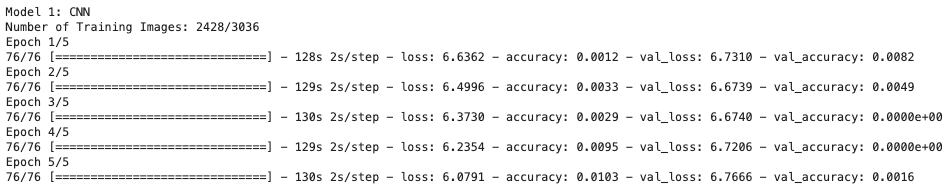

# BIRDEX
### Web based Flask app to predict the family group of birds from images using transfer learning.


## Table of Contents

- [Overview](#overview)
- [Data Preparation](#data-preparation)
    - [Birds](#birds)
- [Convolutional Neural Network](#convolutional-neural-network)
- [Birdex: Flask App](#birdex:-flask-app)
- [Summary](#summary)
- [Issues Notes](#issues-notes)
- [Future Work](#future-work)

## Overview


The data was pulled from the [The Cornell Lab of Ornithology](https://www.birds.cornell.edu/home).  
It is a collection of about 48,000 images and more than 400 species of birds observed in North America. Birds are separated by male, female or juvenile since they look quite different. Text files are also included that contains image file names and their corresponding labels.

So why is bird conservation import? Check out this post by the American Bird Conservancy:

[Why Bird Conservation is Important](https://abcbirds.org/about/mission-and-strategy/why-conserve-birds/)

Also, they're basically modern dinosaurs.


This Berkeley articles on why birds are dinosaurs (but also shows the skeptical side):
[Are Birds Really Dinosaurs?](https://ucmp.berkeley.edu/diapsids/avians.html)


## Data Preparation

Since there are many images, Amazon S3 came into play. The images are loaded into a bucket and stored in separated folders of the bird species.
For this project, 21129 images will be used which includes 39 family groups of birds.

A function is written to retrieve the images from the S3 bucket while also resizing them, convert to array, and append to a list. This is due to the need for the input of the neural network to be numpy arrays.

<details>
  <summary>
    <b> Load and Resize Image Code </b>  
  </summary>
  
```python

def resize_images_array(img_dir, folders, bucket):
    # arrays of image pixels
    img_arrays = []
    labels = []
    
    # loop through the dataframe that is linked to its label so that all images are in the same order
    for folder in tqdm(folders):
        s3 = boto3.client('s3')
        enter_folder = s3.list_objects_v2(Bucket=bucket, Prefix=f'{img_dir}/{folder}')
        for i in enter_folder['Contents'][2:]:
            try:
                filepath = i['Key']
                obj = s3.get_object(Bucket=bucket, Key=f'{filepath}')
                img_bytes = BytesIO(obj['Body'].read())
                open_img = Image.open(img_bytes)
                arr = np.array(open_img.resize((299,299)))
                img_arrays.append(arr)
                labels.append(folder)
            except:
                print(filepath) # get file_path of ones that fail to load
                continue

    return np.array(img_arrays), np.array(labels)

```
</details>

### Birds EDA

The images have 3 different channels for the color which makes up the colors in the main image.
The shape of the images are **(299,299,3)**, the third one represent the number of channels. For greyscale, it'd be 1.

Let's check out some of the contestant within the data!

Contestant 1: Waterfowl    |  Contestant 2: Grosbeak   |     Contestant 3: Hawk
:-------------------------:|:-------------------------:|:-------------------------:
|  | 

  
Here are the RGB Channels of three classes of birds seen in this dataset:


The exploratory data analysis began with looking at the number of species in the Order group of the birds.

Since the interest is predicting birds based on family groups, a count plot for the number of species in each family group is created.


## Convolutional Neural Network

This first model was trained on a small subset (~3,000) of the total images(~40,000). This is mainly to test that the inputs of features and labels are correct. Errors did occur the very first run.

<details>
    <summary>Shape of training sets and testing sets.</summary>
    
</details>

The model is pretty weak.


This is what the CNN layers look like generally:
<details>
    <summary>CNN Code</summary>
    
</details>

After the first awful run, a simple model will be created using 3 types of birds: ducks, finches and hawks. This is to see if the amount of classes was causing the model to do so poorly. It will later be expanded to more.

### Simple CNN Model

<details>
    <summary>CNN Model Epochs</summary>
    
</details>

<details>
    <summary>CNN Model Accuracy/Loss Plots</summary>
    
</details>

<details>
    <summary>CNN Model Confusion Matrix</summary>
    
    After a few runs, it finally captured the finches!
</details> 

### Transfer Learning using Xception Model

<details>
    <summary>Model Summary</summary>
    
</details>

<details>
    <summary>Model Epochs</summary>
    
</details>

<details>
    <summary>Model Accuracy/Loss Plots</summary>
    
    
</details>

<details>
    <summary>Model Confusion Matrix</summary>
    
</details>

## Birdex: Flask App

## Issues Notes

- birds are labeled by species but also by gender and juvenile/adult. They DO all looke quite different especially the colors between the females and males
- another reason for poor model: birds dont have the same amount of images, some have 20 something, some has 120
    - A TON of labels (555 total), very sparse, along with unbalanced amounts of bird images
    - checked inputs, y labels and x labels
    - checked images folders, different amounts of bird images
    - checked slicing and what images i am getting, turns out i could be slicing where each bird only has one image
        - fix by grabbing sequentially because all the birds in one folder are next to each other in dataframe
- model was awful, figured out one hot encoded the wrong numbers due to the fact that some numbers are missing and not in a perfect range


## Future Work

- [x] Better Model
- [x] Transfer Learning
- [ ] SHAP/LIME
- [ ] Clean up files
- [ ] Object Detection